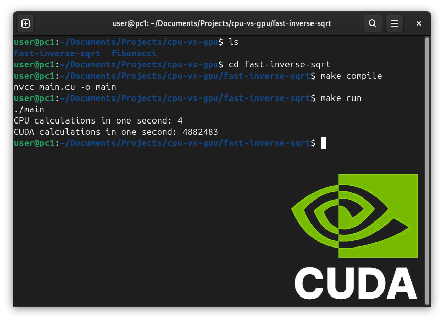

# cpu-vs-gpu



A collection of algorithms written using a classical CPU approach and a GPU (CUDA) approach.

CUDA outperforms algorithms that can be parallelized (such as many Fast Inverse Square Roots) but lacks efficiency in algorithms that cannot (such as many Fibonacci sequences).

## Fast Inverse Square Root
```
CPU calculations in one second: 4
CUDA calculations in one second: 4590599
```